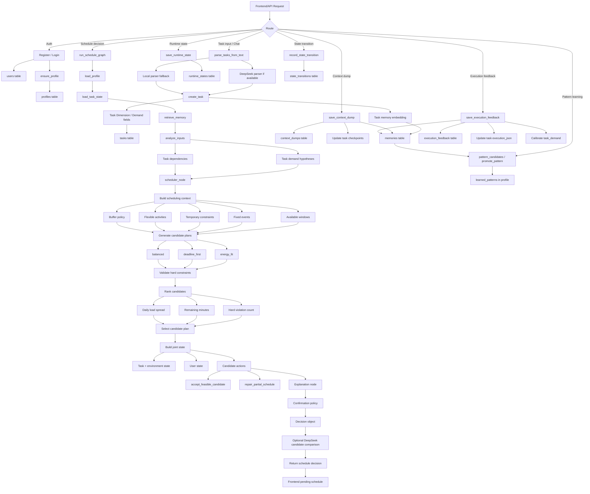

# HumanOS Backend Logic



## Core Decision Formula

```text
Joint state = task/environment state + user state

Decision =
  analyze inputs
  -> generate candidate plans
  -> validate constraints
  -> compare candidates
  -> select recommendation
  -> require user confirmation
  -> record feedback / transitions after execution
```

## Main Backend Files

- `backend/humanos_server.py`: API routes, SQLite store, task parsing, memory, feedback, state transition, DeepSeek calls.
- `backend/humanos_graph.py`: scheduling graph, candidate-plan generation, validation, candidate selection, confirmation policy.
